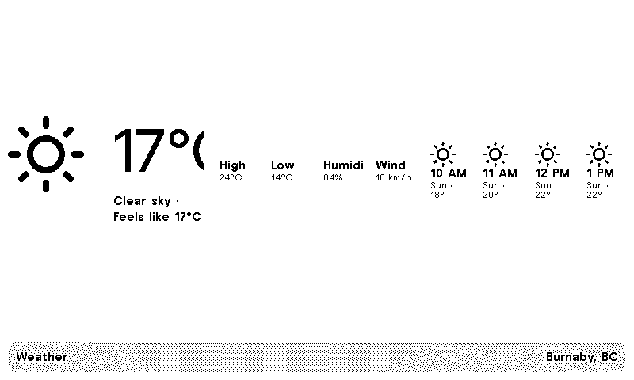

# Weather

A weather plugin that polls [Open-Meteo](https://open-meteo.com) — a free weather API requiring no API key — for current conditions and a 4-hour forecast, rendered with inline SVG weather icons optimized for TRMNL's 1-bit e-ink display.

## Demo



## How It Works

### Transform
The `src/transform.py` serverless transform maps WMO weather codes (numeric) to both human-readable condition labels and icon names. This is why this plugin differs from a simple polling-only setup: it's doing data reshaping that the templates can't easily do themselves.

- Maps all 27 WMO codes (0–99) to icon names (`sun`, `cloud-sun`, `cloud`, `fog`, `cloud-drizzle`, `cloud-rain`, `cloud-snow`, `cloud-lightning`)
- Extracts current conditions from the API response and next 4 hourly forecasts
- Returns a dict with: `location`, `temperature`, `feels_like`, `humidity`, `wind_speed`, `condition`, `icon`, `high`, `low`, `hourly` (array of time/temp/condition/icon)

### Templates
Four layout templates (quadrant, half_horizontal, half_vertical, full) each render the same data differently:
- **Quadrant** (400×240) — compact icon + large temp, horizontal hourly grid
- **Half horizontal** (800×240) — icon + temp + range, 4-column hourly grid
- **Half vertical** (400×480) — icon + temp + range, stacked hourly list
- **Full** (800×480) — large icon, temp + feels-like, stats grid (high/low/humidity/wind), 4-column hourly grid

### Icons
`src/shared.liquid` defines a reusable `weather_icon` template rendered via ``. Each icon is hand-drawn inline SVG with stroke-based geometry (no fills) for crisp 1-bit dithering.

## Local Development

**Lint:**
```bash
./bin/trmnlp lint
```

**Preview:**
```bash
docker run --rm --publish 4567:4567 \
  --volume "$(pwd):/plugin" \
  --volume "$HOME/.config/trmnlp:/root/.config/trmnlp" \
  trmnl/trmnlp serve
```
Then open http://localhost:4567/render/full.png (or quadrant/half_horizontal/half_vertical) in your browser or curl.

## Deployment

- **Lint on PR:** GitHub Actions lints the plugin on every pull request
- **Push on merge:** Merging to `main` auto-pushes to the TRMNL account via the `TRMNL_API_KEY` secret
- **Preview refresh:** Demo GIF regenerates on each push to `main` (commits back with `[skip ci]` to prevent loop-back)

## Known Limitations

Location is hardcoded to **Burnaby, BC** in `src/settings.yml`'s `polling_url`. A future version could parameterize this via plugin settings or a user config.
